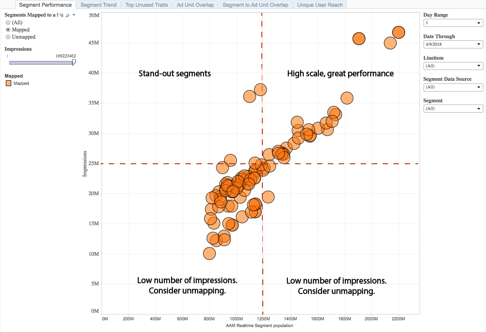

# Informe de Rendimiento del segmento{#segment-performance-report}

El informe Rendimiento del segmento compara segmentos asignados y sin asignar por impresiones y únicos de segmentos en tiempo real.

Un segmento asignado es un segmento que se crea y se envía a un destino para su objetivo. Un segmento sin asignar es un segmento que ha creado pero que no ha enviado a un destino para su objetivo.

La comparación de estos diferentes tipos de segmentos dentro de los informes y entre ellos le ayuda a optimizar las campañas existentes y a encontrar los segmentos que se han pasado por alto y que quizá desee enviar a un destino para el objetivo.

## Casos de uso {#use-cases}

Con el informe [!UICONTROL Segment Performance] puede:

* Identifique los segmentos de audiencia asignados que impulsan la escala o el rendimiento.
* Identifique los segmentos sin asignar que se van a presentar en futuras campañas, en función de la contribución de una audiencia al rendimiento anterior.

## Uso del informe Rendimiento del segmento {#using-segment-performance-report}

Alternar entre **[!UICONTROL Mapped]** y **[!UICONTROL Unmapped]** para seleccionar segmentos que estén asignados a un destino o no. Seleccione **[!UICONTROL All]** para incluir todos los segmentos en el informe.

Utilice los controles **Intervalo de días** y **Pasar a la fecha** para ajustar el intervalo retrospectivo. Tenga en cuenta que los períodos retrospectivos de 7 y 30 días solo están disponibles para las fechas de domingo.

Utilice el cuadro desplegable **[!UICONTROL Line Item]** para seleccionar las propiedades web para las que desea devolver información.

En el cuadro desplegable **[!UICONTROL Segment Data Source]**, seleccione las fuentes de datos que contengan los segmentos que desee ver en el informe.

Utilice el cuadro desplegable **[!UICONTROL Segment]** para seleccionar los segmentos que desee ver en el informe.

>[!IMPORTANT]
>
>Al habilitar [!UICONTROL Audience Optimization for Publishers], debe incluir metadatos descriptivos para [!UICONTROL Line Item IDs], tal como se describe en el paso 3 de [Importar archivos de datos de Google Ad Manager (anteriormente DFP) en Audience Manager](../../../reporting/audience-optimization-reports/aor-publishers/import-dfp.md). Al hacer esto, se asegura de que el informe detalla la propiedad web como [!UICONTROL Line Item] en lugar de [!UICONTROL Line Item ID].

## Interpretación de los resultados {#interpreting-results}

Su informe [!UICONTROL Segment Performance] podría tener un aspecto similar al de abajo. En el informe, haga clic en una burbuja para vista de los datos subyacentes. Consulte las descripciones para obtener información adicional en la tabla debajo del informe de muestra.

<table id="table_AFE2540583C34835B04584693ADFD26A"> 
 <thead> 
  <tr> 
   <th colname="col1" class="entry"> Elemento </th> 
   <th colname="col2" class="entry"> Descripción </th> 
  </tr>
 </thead>
 <tbody> 
  <tr> 
   <td colname="col1"> 
Segmento 
 </td> 
   <td colname="col2"> 
El nombre alfanumérico que asignó a este segmento. 
 </td> 
  </tr> 
  <tr> 
   <td colname="col1"> 
ID del segmento 
 </td> 
   <td colname="col2"> 
ID única de este segmento. 
 </td> 
  </tr> 
  <tr> 
   <td colname="col1"> 
Elemento de línea 
 </td> 
   <td colname="col2"> 
La propiedad web para la cual está viendo este informe. 
 </td> 
  </tr> 
  <tr> 
   <td colname="col1"> 
Clics 
 </td> 
   <td colname="col2"> 
El número de veces que los miembros de esta característica han hecho clic en elementos de la propiedad web. 
 </td> 
  </tr> 
  <tr> 
   <td colname="col1"> 
Impresiones 
 </td> 
   <td colname="col2"> 
El número de veces que los miembros de esta característica han estado expuestos al inventario. 
 </td> 
  </tr> 
  <tr> 
   <td colname="col1"> 
CTR 
 </td> 
   <td colname="col2"> 
Tasa de pulsaciones. 
 
Esta métrica muestra el porcentaje de impresiones seguidas de clics. Dividir clics por impresiones para obtener esta métrica. 
 </td> 
  </tr> 
  <tr> 
   <td colname="col1"> 
Población de segmentos en tiempo real 
 </td> 
   <td colname="col2"> 
El número real de visitantes únicos vistos en tiempo real durante el intervalo de tiempo especificado y que estaban calificados para el segmento en el momento en que fueron vistos por  Audience Manager. 
 </td> 
  </tr> 
 </tbody> 
</table>

## Cómo leer los resultados del segmento asignado {#read-mapped-segment}

La posición de los segmentos asignados en un informe puede indicarle mucho sobre qué segmentos tienen un buen rendimiento y dónde podría necesitar realizar algunos ajustes.

Para leer el informe, ayuda a dividir los resultados en cuatro secciones con líneas imaginarias (en rojo) y las categorías mostradas en el informe de muestra a continuación. Las etiquetas del ejemplo pueden ayudarle a comprender el rendimiento de los segmentos y a responder a estos resultados.

## Cómo leer los resultados del segmento sin asignar {#read-unmapped-segment}

Ver segmentos sin asignar en un informe [!UICONTROL Segment Performance] es una buena manera de encontrar nuevos segmentos que no ha considerado para objetivos. De hecho, algunos de estos segmentos pueden superar el rendimiento de los segmentos asignados.

Para leer este informe, ayuda a dividir los resultados en cuatro secciones con líneas imaginarias (en rojo) y categorías que se muestran en el informe de muestra a continuación.

