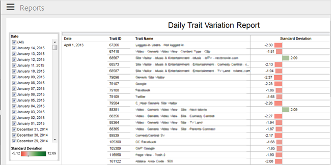

# Informe de variación del rasgo diario {#daily-trait-variation-report}

Este informe devuelve una lista de características que se han realizado al menos 10 000 veces en los 30 días anteriores a la fecha o fechas seleccionadas y que tienen una desviación estándar mayor o igual a 1,7 en cualquier dirección y durante el mismo intervalo de tiempo. El informe ayuda a evaluar cómo fluctúa con el tiempo el número de impresiones de usuarios únicos en un rasgo.

>[!NOTE]
>
>El informe Variación de rasgos diaria de Audience Manager se adhiere a los principios de RBAC. Solo puede ver características de orígenes de datos a los que tenga acceso según el [grupo de usuarios RBAC](/help/using/features/administration/administration-overview.md) al que pertenezca.

La desviación estándar mide la cantidad de variación o dispersión con respecto a la media (o el valor medio/esperado). Una desviación estándar baja indica que los puntos de datos tienden a estar muy cerca de la media. Una desviación estándar alta indica que los puntos de datos se distribuyen en un gran intervalo de valores.

Utilice la lista [!UICONTROL Date] para seleccionar una o más fechas para el informe. Se muestra un gráfico de barras con códigos de color en la parte inferior de la lista que proporciona un representante visual del rango de desviación estándar para todos los rasgos en todas las fechas seleccionadas. La línea vertical negra indica la media.

La columna central contiene una lista de características, identificadas por [!UICONTROL Trait ID] y [!UICONTROL Trait Name]. Haga clic en cualquier rasgo para acceder a un cuadro de diálogo emergente que le permite seleccionar entre las siguientes opciones:

* **Conservar solo:** Elimina todos los demás rasgos del informe y muestra solo los datos de este rasgo.
* **Excluir:** Elimina este rasgo del informe y muestra los datos de todos los demás rasgos. Puede excluir varios rasgos.
* **Ver datos:** Permite mostrar los datos de esa fila. También puede descargar todas las filas como archivo de texto.

La columna [!UICONTROL Standard Deviation] muestra gráficos de barras con códigos de color que muestran la desviación estándar de cada rasgo durante el intervalo seleccionado. Las barras rojas indican rasgos con una desviación estándar negativa (los puntos de datos tienden a estar por debajo de la media). Las barras verdes indican rasgos con una desviación estándar positiva (los puntos de datos tienden a estar por encima de la media). Pase el ratón sobre cualquier barra para mostrar un cuadro de diálogo emergente con más información y opciones para mantener o excluir esa característica y ver más información.

Los iconos se muestran en la parte inferior del informe y permiten exportar datos en varios formatos, revertir cualquier cambio que haya realizado en el informe (como la exclusión de características), habilitar o deshabilitar las actualizaciones automáticas y actualizar los datos del informe. Consulte [Iconos y herramientas de informes explicados](../../reporting/dynamic-reports/interactive-report-technology.md#icons-tools-explained).

## Casos de uso {#use-cases}

**Ejemplo #1**: este informe puede ser muy útil en situaciones en las que tiene características con un nivel de estacionalidad alto. Por ejemplo, supongamos que su tienda en línea está probando promociones de temporada de varios tipos y precios. Tiene los siguientes rasgos definidos en [!DNL Audience Manager]:

* `productPage == "December Promotion"`
* `price > "500"`

Supongamos que ejecuta el informe [!UICONTROL Daily Trait Variation] el 20 de diciembre y que observa una desviación positiva sólida en los rasgos mencionados anteriormente en los últimos 30 días. Esto puede sugerir que sus visitantes están buscando los productos mencionados en su promoción de temporada. Para capitalizar esta tendencia, puede invertir más esfuerzo en segmentar los elementos creativos de esa categoría de producto específica en los visitantes que estén interesados en ellos.

**Ejemplo #2**: este informe puede ayudarle a identificar anomalías de segmentación relacionadas con problemas de etiquetado o configuraciones incorrectas de características. Imagine que ha definido el siguiente rasgo en función de las categorías de su tienda en línea:

* `productPage == "smartphones"`

Debido a la reconfiguración de tu tienda, estás dividiendo la página de los smartphones en varias páginas, según los nombres de las marcas. Sin embargo, olvidó actualizar los rasgos definidos en [!DNL Audience Manager].

Un mes después, ejecuta el informe [!UICONTROL Daily Trait Variation] y observa una gran desviación negativa en el rasgo `productPage == "smartphones"`, aunque el número de visitantes ha aumentado, según el análisis del sitio. Basándose en esta información, se da cuenta de que no ha actualizado los rasgos de [!DNL Audience Manager] para sus nuevas páginas de productos, por lo que sabe que necesita crear los siguientes rasgos:

* productPage == &quot;samsung&quot;
* productPage == &quot;apple&quot;
* productPage == &quot;huawei&quot;

Una vez que lo haga, verá que su audiencia se clasifica para los rasgos recién creados.
