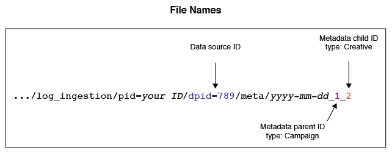

# Overview and Mappings for Metadata Files{#overview-and-mappings-for-metadata-files}

Un archivo de metadatos vincula ID numéricos con nombres que puede leer y comprender. Los informes de Optimización de audiencias muestran nombres legibles en los distintos menús de opciones de informes.

## Información general {#overview}

Una revisión de los metadatos y su uso. Un archivo de metadatos debe estar acompañado de un archivo de datos. El contenido del archivo de metadatos coincide con la información del archivo de datos a etiquetas relacionadas con humanos en los menús del informe. For more information, see [Data Files for Audience Optimization Reports](../../../reporting/audience-optimization-reports/metadata-files-intro/datafiles-intro.md).

### Los archivos de metadatos contienen datos sobre otros datos

Un archivo de metadatos contiene información sobre otros tipos de datos. To help you understand how this works, let’s review how [!DNL Audience Manager] receives data.

During an impression or click event, [!DNL Audience Manager] receives data in an URL string known as an *event call*.

La llamada de evento organiza información en conjuntos de pares de clave-valor definidos. Los valores de un par de valores clave contienen datos numéricos. El archivo de metadatos contiene nombres y otra información legible correspondiente al ID en cada par de valor clave.

### ID de vínculos de metadatos a nombres legibles

El archivo de metadatos es necesario para asociar un ID numérico a un nombre legible. As an example, say an event call contains a creative ID in a key-value pair like this: `d_creative:1234`. Sin un archivo de metadatos, este elemento creativo se mostraría como 1234 en un menú de opciones.

Sin embargo, un archivo de metadatos con formato correcto puede relacionar este elemento creativo con un nombre real como «Anunciante Creative A», que es un nombre que puede leer y reconocer en un informe.

### Cuándo necesita un archivo de metadatos

First, a metadata file, and all of the parameters listed below, are required in an event call when you want to use the [Audience Optimization Reports](../../../reporting/audience-optimization-reports/audience-optimization-reports.md).

Second, you need a metadata file if you’re sending your own data to [!DNL Audience Manager] or if you want to see data in the reports from other providers we’re not integrated with. For example, [!DNL Audience Manager] has an integration with Google’s [Double-click Campaign Manager](../../../reporting/audience-optimization-reports/aor-advertisers/import-dcm.md) (DCM). Because of this relationship, [!DNL Audience Manager] can associate IDs with names and descriptions used by the report options. Sin una integración, aún podemos ingesta datos, pero las opciones del informe mostrarán ID numéricos en lugar de un nombre descriptivo.

## File Mappings {#file-mappings}

The following table lists the key-value pairs that hold data used by the [!UICONTROL Audience Optimization] reports. Si necesita utilizar un archivo de metadatos, debe contener información legible en lenguaje natural que corresponda a los valores de estos pares de valor clave. Los valores de estas claves aceptan únicamente enteros (tipo de datos INT). Note, *italics* indicates a variable placeholder. Otros elementos son constantes o claves y no cambian.

>[!IMPORTANT]
>
>If you're using the [!UICONTROL Audience Optimization] reports, *all* of these values are required in the event call.

<table id="table_B2C8C493080E449CA71C4EF07D9476BD"> 
 <thead> 
  <tr> 
   <th colname="col1" class="entry"> Opción de informe </th> 
   <th colname="col2" class="entry"> Pares de clave-valor de metadatos </th> 
  </tr> 
 </thead>
 <tbody> 
  <tr> 
   <td colname="col1"> 
Anunciante 
 </td> 
   <td colname="col2"> 
 <code>d_ adsrc = <i>ID de fuente de datos o código de integración</i></code> 
 
Es el ID de fuente de datos del anunciante o el código de integración proporcionado al crear una fuente de datos. See <a href="../../../features/manage-datasources.md#create-data-source"> Create a Data Source</a>. 
 </td> 
  </tr> 
  <tr> 
   <td colname="col1"> 
Unidad comercial (BU) 
 </td> 
   <td colname="col2"> 
 <code>d_ bu = <i>ID de unidad comercial</i></code> 
 </td> 
  </tr> 
  <tr> 
   <td colname="col1"> 
Campaign 
 </td> 
   <td colname="col2"> 
 <code>d_ campaign = <i>id de campaña</i></code> 
 </td> 
  </tr> 
  <tr> 
   <td colname="col1"> 
Elemento creativo 
 </td> 
   <td colname="col2"> 
 <code>d_ creative = <i>creative ID</i></code> 
 </td> 
  </tr> 
  <tr> 
   <td colname="col1"> 
Exchange 
 </td> 
   <td colname="col2"> 
Acepta dos pares de clave-valor diferentes: 
 
    <ul id="ul_3B3B751A8A134096B0912E81A0983B9D"> 
     <li id="li_57BAC45A7B274AB695945E174A4D8A35"> <code>d_ exchange = <i>ID para el intercambio que sirvió al anuncio</i></code> </li> 
     <li id="li_CCDF00DE59D3451C8EF590DD3E1A806D"> <code>d_ site = <i>ID del sitio una publicidad servida en</i></code> </li> 
    </ul> </td> 
  </tr> 
  <tr> 
   <td colname="col1"> 
Orden de inserción (IO) 
 </td> 
   <td colname="col2"> 
 <code>d_ io = <i>ID del pedido de inserción</i></code> 
 </td> 
  </tr> 
  <tr> 
   <td colname="col1"> 
Plataforma 
 </td> 
   <td colname="col2"> 
 <code>d_ src = <i>ID de fuente de datos</i></code> 
 
This is the <a href="../../../features/datasources-list-and-settings.md#data-sources-list-and-settings"> data source</a> ID for the platform providing metadata information (e.g., DFA, Atlas, GBM, MediaMath, etc.). 
 </td> 
  </tr> 
  <tr> 
   <td colname="col1"> 
Táctica 
 </td> 
   <td colname="col2"> 
 <code>d_ tactic = <i>táctica ID</i></code> 
 </td> 
  </tr> 
  <tr> 
   <td colname="col1"> 
Vertical 
 </td> 
   <td colname="col2"> 
 <code>d_ vert = <i>ID vertical</i></code> 
 </td> 
  </tr> 
 </tbody> 
</table>

## How Event Call IDs Shape File Names, Contents, and Delivery Paths {#how-ids-shape-file-names}

Los ID pasados por estos pares clave-valor ayudan a crear el nombre de archivo de metadatos y su contenido. Las siguientes secciones e ilustraciones muestran cómo funciona. En estos ejemplos se crea un archivo que contiene el nombre de un elemento creativo de una campaña, pero es posible realizar otras combinaciones.

### Llamada de evento

In this example we'll create a metadata file that brings creative names in to an [!UICONTROL Audience Optimization] report. Para ello, necesitamos extraer los ID de elementos creativos, campañas y fuentes de datos de una llamada de evento.

### Nombre del archivo

El nombre del archivo se basa en los ID de elementos creativos, campañas y fuentes de datos. En este caso, compare las diferencias entre los datos de valor clave en una llamada de evento y cómo se utiliza en un nombre de archivo.

En un nombre de archivo:

* The data source key changes to `dpid` from `d_src`.

* Los ID de elementos creativos y de campañas representan una categoría en lugar de un identificador real.

See [Naming Conventions for Metadata Files](../../../reporting/audience-optimization-reports/metadata-files-intro/metadata-file-names.md).

### Contenido del archivo

En este ejemplo, el contenido del archivo refleja los ID de campañas y elementos creativos que se pasan en la llamada de evento. El nuevo elemento aquí es un nombre legible. Once processed, the name in this file will appear as an option in the Creative menu of an [!UICONTROL Audience Optimization] report.

See [Content Format for Metadata Files](../../../reporting/audience-optimization-reports/metadata-files-intro/metadata-file-contents.md).

### Entrega de archivos

After you name and add data to a file, you send it to an Amazon S3 storage directory provided by [!DNL Audience Manager]. See [Delivery Methods for Metadata Files](../../../reporting/audience-optimization-reports/metadata-files-intro/metadata-delivery-methods.md) and [Status Updates for Metadata Files](../../../reporting/audience-optimization-reports/metadata-files-intro/metadata-update-status.md).

>[!MORE_ LIKE_ THIS]
>
>* [Archivos de datos para informes de optimización de audiencias](../../../reporting/audience-optimization-reports/metadata-files-intro/datafiles-intro.md)
>* [Captura de datos de clic de campaña mediante llamadas de píxel](../../../integration/media-data-integration/click-data-pixels.md)
>* [Capturación de los datos de impresión de campaña a través de Pixel Calls](../../../integration/media-data-integration/impression-data-pixels.md)

