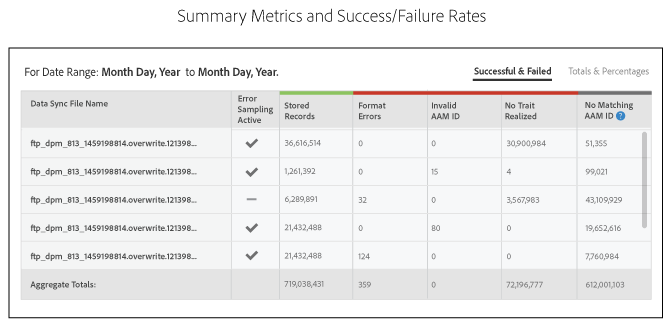

# Informe de Estado de incorporación{#onboarding-status-report-about}

El informe de Estado de incorporación comprueba las tasas de éxito y fracaso del procesamiento de registros en los archivos de fuente de datos entrante. Este informe muestra los datos en un gráfico de barras interactivo y proporciona métricas resumidas en forma de tabla. Además, incluye una opción que muestrea archivos durante un intervalo de tiempo fijo y muestra los errores más comunes para cada tipo de error. Este informe se encuentra en Analytics > Informe de Estado de incorporación. Este informe también está disponible cuando se crea un fuente de datos entrante.

>[!NOTE]
>
>Sólo los usuarios con privilegios de administrador pueden ver este informe en la interfaz de Audience Manager usuario. Puede solicitar que los usuarios que no sean administradores sean notificados sobre el estado de los archivos entrantes cargados agregando sus mensajes de correo electrónico al informe. Consulte [Recibir notificaciones](/help/using/reporting/onboarding-status-report.md#receive-email-notifications) por correo electrónico.

## Incorporación Estado informe: acerca de {#onboarding-status-about}

Comprueba [!UICONTROL Onboarding Status Report] las tasas de éxito y fracaso del procesamiento de registros en los archivos de fuente de datos entrante. Este informe muestra los datos en un gráfico de barras interactivo y proporciona métricas resumidas en forma de tabla. Además, incluye una opción que muestrea archivos durante un intervalo de tiempo fijo y muestra los errores más comunes para cada tipo de error. Este informe se encuentra en **[!UICONTROL Analytics > Onboarding Status Report]**. Este informe también está disponible cuando se crea un fuente de datos entrante.

## Error Informes y muestreo Error {#error-reporting-sampling}

Error sistema de informes y muestreo de error son dos características separadas del [!UICONTROL Onboarding Status] informe.

<table id="table_4706D891D4C545E8BF9D8A0CC052CC48"> 
 <thead> 
  <tr> 
   <th colname="col1" class="entry"> Función </th> 
   <th colname="col2" class="entry"> Descripción </th> 
  </tr> 
 </thead>
 <tbody> 
  <tr> 
   <td colname="col1"> 
 <b>Informes Error</b> 
 </td>
   <td colname="col2"> 
Error sistema de informes muestra las tasas de éxito y fracaso del número de registros procesados en una fuente de datos entrante. Devuelve datos de forma interactiva, apilada gráfico de barras y como métricas de resumen en las tablas debajo del gráfico. 
 
Error sistema de informes es automático. Se ejecuta continuamente para todas las fuentes de datos entrantes. Devuelve datos basados en el rango de intervalos de tiempo preestablecidos o un intervalo de tiempo personalizado que usted estableció con un widget de calendario. 
 </td> 
  </tr> 
  <tr> 
   <td colname="col1"> 
 <b>Muestreo Error</b> 
 </td>
   <td colname="col2"> 
Error muestreo analiza el contenido de los archivos de datos y devuelve los 10 errores más comunes para cada tipo de error. Los errores en los archivos de datos de entrada impiden que se procesen registros individuales. Utilice este informe como herramienta de solución de problemas para ayudar a reducir el número de errores de archivos y mejorar las tasas de procesamiento. 
 
Debe activar el muestreo de error manualmente. Funciona durante 14 días a partir del día de activación y luego se apaga solo. Puede volver a activar el muestreo de error una vez que expire el intervalo de 14 días. Se activa el muestreo de error al <a href="../features/manage-datasources.md#create-data-source"> crear un fuente de datos</a> entrante o al marcar la casilla de verificación Muestreo <b></b> de Error de la  sección Configuración de Origen de datos de un fuente de datos de entrada existente. 
 
Error muestreo es un proceso computacionalmente exigente. Como resultado, solo devuelve los primeros 10 errores para cada categoría. No está diseñado para devolver todos los errores contenidos en un fuente de datos entrante. Estos errores son una muestra representativa de un grupo potencialmente mayor de errores similares. Revise todo el archivo en busca de los tipos de errores que señala este informe, vuelva a formatear el archivo y envíelo de nuevo. 
 
Consulte <a href="../integration/sending-audience-data/batch-data-transfer-explained/inbound-file-contents.md"> Contenido de la Archivo de datos de entrada: sintaxis, variables y ejemplos</a> para obtener más información sobre cómo formato correctamente un archivo de datos para un fuente de datos de entrada. 
 </td> 
  </tr> 
 </tbody> 
</table>

## Gráfico de barras de informes de Error {#error-report-bar-chart}

El informe de errores representa las tasas de éxito y error para el procesamiento de registros en un gráfico de barras apilado, como se muestra en el ejemplo siguiente. El gráfico es interactivo. Al hacer clic en una barra se muestran las métricas de resumen de ese día en una tabla debajo del gráfico.

## Error Tables de informes {#error-report-tables}

El informe de errores muestra datos tabulares debajo del gráfico de barras. La tabla muestra las tasas de éxito y fracaso, junto con los totales y porcentajes.

**Registros correctos y fallidos**

Este vista predeterminado muestra un recuento Frecuencia del total de registros del informe e incluye un desglose de los errores por tipo de error.

**Totales y porcentajes**

Haga clic **[!UICONTROL Totals & Percentages]** para ver qué % de sus archivos se procesaron correctamente.

## Error informe de muestreo durante 14 días {#error-reporting-14-days}

Con la muestreo de errores activa, el informe mostrará los 10 errores principales para cada tipo de error. Haga clic en un botón de tipo de error en la parte superior del informe para ver cada conjunto de datos de muestra.

>[!NOTE]
>
>El informe no resalta los errores de registro con esta versión actual. Para buscar y corregir errores de archivos, debe revisar los resultados y compararlos con las especificaciones de la documentación de [Inbound Data Archivo Content](../integration/sending-audience-data/batch-data-transfer-explained/inbound-file-contents.md) .

## Recibir notificaciones por correo electrónico {#receive-email-notifications}

Puede agregar las direcciones correo electrónico de los destinatarios que desea que se notifiquen el estado de los archivos entrantes cargados. Tenga en cuenta que puede seleccionar distintos destinatarios para distintos orígenes de datos.

## Crear un informe de Estado de incorporación {#create-onboard-status-report}

A [!UICONTROL Sample Error Report] devuelve el número de registros de un fuente de datos se procesaron correctamente y cuántos han fallado. Siga estos pasos para generar un [!UICONTROL Sample Error Report]archivo .

<!-- 

create-onboarding-status-report.xml

 -->

1. Vaya a **[!UICONTROL Analytics > Onboarding Status Report]**. Search un fuente de datos o elija uno de los lista.

2. Seleccione una intervalo de fecha. Las opciones incluyen:

   * Un conjunto de intervalos de informe fijos.
   * Widgets de calendario que permiten crear un intervalo de fecha personalizado.

3. Haga clic en **[!UICONTROL OK]**.

## Términos y definiciones de los informes de Estado de integración {#report-terms-conditions}

Una guía de referencia para las etiquetas y los términos utilizados en este informe.

<table id="table_1D44A2E6B4C847848B818190DD336841"> 
 <thead> 
  <tr> 
   <th colname="col1" class="entry"> Término </th> 
   <th colname="col2" class="entry"> Definición </th> 
  </tr> 
 </thead>
 <tbody> 
  <tr> 
   <td colname="col1"> 
 <b>Nombre del Archivo de sincronización de datos</b> 
 </td> 
   <td colname="col2"> 
Enumera los archivos que  Audience Manager reciben y procesan del fuente de datos entrante seleccionado. 
 
Archivo procesamiento fallará si el nombre de archivo tiene un formato incorrecto. Archivo requisitos de nombre varían en función de cómo se envíen estos datos a  Audience Manager. Los métodos de envío incluyen  Amazon S3 y FTP. Para obtener instrucciones sobre cómo asignar un nombre a los archivos, consulte: 
 
 
     <ul id="ul_9A32906A14CA41C5AED0E13930DB31BA"> 
      <li id="li_A5A0E6ED711D4002B52092619F87C7D6"> <a href="../integration/sending-audience-data/batch-data-transfer-explained/inbound-s3-filenames.md"> Requisitos de nombre de Amazon S3 para el Archivos de datos de entrada </a> </li> 
     </ul> 
 </td> 
  </tr> 
  <tr> 
   <td colname="col1"> 
 <b>Errores de formato</b> 
 </td> 
   <td colname="col2"> 
Enumera el número de registros que no pudieron procesarse porque no coincidían con los requisitos de sintaxis o formato. Consulte <a href="../integration/sending-audience-data/batch-data-transfer-explained/inbound-file-contents.md"> Contenido Archivo de datos de entrada: sintaxis, variables y ejemplos</a> para obtener información sobre cómo formato los datos. 
 </td> 
  </tr> 
  <tr> 
   <td colname="col1"> 
 <b>ID de AAM no válido</b> 
 </td> 
   <td colname="col2"> 
Muestra el número de ID de usuario de Audience Manager (UUID) con formato  incorrecto. Normalmente, esto indica los ID: 
 
    <ul id="ul_8304250E8F0F44918A50CF9D8D8D1F83"> 
     <li id="li_B100B4C2623B4E099E022869A4978357">No coincidió con el formato esperado de 38 dígitos. </li> 
     <li id="li_44E8A9AD13174A20A5742E56ED786634">Contienen caracteres alfabéticos. Las ID deben ser solo números. </li> 
    </ul> </td> 
  </tr>

<tr> 
   <td colname="col1"> 
 <b>ID de dispositivo no válido</b> 
 </td> 
   <td colname="col2"> 
Muestra el número de ID de dispositivo globales con formato incorrecto. Consulte <a href="../reference/ids-in-aam.md">Index de ID en Audience Manager</a> y <a href="../features/global-data-sources.md">Fuentes</a>  de datos globales para obtener detalles sobre cómo se debe formatear dispositivos ID y qué fuentes de datos globales debe utilizar, según el tipo de dispositivo.

  
La sección muestreo de errores del informe incluye información detallada sobre las ID de dispositivos de no válido, como:

   <ul>
    <li>ID de fuente de datos correspondiente al ID de dispositivos de no válido;</li>
    <li>El no válido dispositivos ID;</li>
    <li>Tipo de ID de dispositivos esperado, basado en el fuente de datos.</li>
   </ul>
  </tr>

<tr> 
   <td colname="col1"> 
 <b>No hay ningún ID de AAM coincidente</b> 
 </td> 
   <td colname="col2"> 
Se trata de  ID incorporados Audience Manager no coinciden con un ID existente. Los ID incorporados pueden tener este estado cuando  aún no Audience Manager realizado un sincronizar de ID o si todavía no pueden coincidir con el ID igualado después de una sincronización. 
 
En el caso de ID móviles no coincidentes,  Audience Manager hará lo siguiente: 
 
    <ul id="ul_B0D6AF9EB27D4017B35E36824B403879"> 
     <li id="li_D141000A50D3463182CBA4571DCC5373">Continuar para tienda e intentar sincronizar este ID. </li> 
     <li id="li_2EFCEE716F254ABCBC5FBF749B7564E6">Regístrelo como  registro almacenado en el informe si no se puede sincronizar el ID. </li> 
    </ul> 
Si el archivo integrado contiene ID móviles, puede tratar estos números con un poco más de ligereza que el resto de métricas. No afectarán a las tasas de éxito y coincidencia para archivos posteriores. 
 </td> 
  </tr> 
  <tr> 
   <td colname="col1"> 
 <b>No se ha obtenido ningún rasgo</b> 
 </td> 
   <td colname="col2"> 
Enumera las características que  Audience Manager no pueden coincidir con una característica integrada. Esto podría ser el resultado de: 
 
    <ul id="ul_43619035AB6641B6949302FB50BDB5B1"> 
     <li id="li_D4C6306BF2B143198108702B309CE8CF">Características formateadas incorrectamente en el archivo de datos de entrada. Para obtener información sobre cómo formato el archivo de datos, consulte <a href="../integration/sending-audience-data/batch-data-transfer-explained/inbound-file-contents.md"> Contenido del Archivo de datos de entrada: sintaxis, variables y ejemplos</a>. </li> 
     <li id="li_A1C708A007D24EE09B7C629AFC6E43C3">Características que aún no se han definido en  Audience Manager. </li> 
    </ul> </td> 
  </tr> 
  <tr> 
   <td colname="col1"> 
 <b>Porcentaje de éxito</b> 
 </td> 
   <td colname="col2"> 
El porcentaje de registros del archivo que se almacenaron correctamente. Porcentaje de éxito = registros procesados/número de registros en un archivo. 
 </td> 
  </tr> 
  <tr> 
   <td colname="col1"> 
 <b>Registros recibidos</b> 
 </td> 
   <td colname="col2"> 
El número total de registros recibidos. En la mayoría de los casos, este número debe coincidir con el número total de registros (líneas) en el archivo de datos de entrada. 
 </td> 
  </tr> 
  <tr> 
   <td colname="col1"> 
 <b>Registros almacenados</b> 
 </td> 
   <td colname="col2"> 
Número de registros almacenados correctamente. Debido a errores de formato archivos, es posible que Audience Manager no almacene  algunos de los registros recibidos. El número de registros almacenados puede ser menor que el número de registros recibidos. 
 </td> 
  </tr> 
  <tr> 
   <td colname="col1"> 
 <b>Total de rasgos realizados</b> 
 </td> 
   <td colname="col2"> 
El número de características para todos los usuarios en todos los archivos entrantes que se almacenan en la  plataforma Audience Manager . 
 </td> 
  </tr> 
  <tr> 
   <td colname="col1"> 
 <b>Total de señales no utilizadas</b> 
 </td> 
   <td colname="col2"> 
Número total de señales no utilizadas recibidas en el informe. Este total se basa en el número total de registros almacenados correctamente. 
 
Consulte <a href="../reporting/dynamic-reports/unused-signals.md"> Informe</a> de señales no utilizadas para obtener más información. 
 </td> 
  </tr> 
 </tbody> 
</table>
