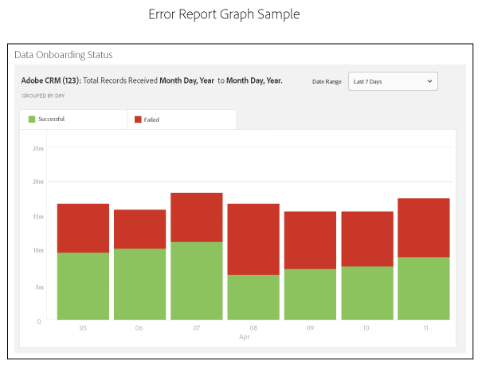

# Informe de estado de integración{#onboarding-status-report-about}

El informe de estado de carga comprueba las tasas de éxito y de error para procesar los registros en los archivos de origen de datos de entrada. Este informe muestra datos en un gráfico de barras interactivo y proporciona métricas de resumen en forma de tabla. Además, incluye la opción de los archivos de muestra para un intervalo de tiempo fijo y muestra los errores más comunes para cada tipo de error. Puede encontrar este informe en Analytics > Informe de estado de integración. Este informe también está disponible cuando se crea una fuente de datos de entrada.

>[!NOTE]
>
>Solo los usuarios con privilegios de administrador pueden ver este informe en la interfaz de usuario del Audience Manager. Puede notificar a los usuarios no administradores el estado de los archivos entrantes cargados agregando sus correos electrónicos al informe. Consulte [Recibir notificaciones por correo electrónico](/help/using/reporting/onboarding-status-report.md#receive-email-notifications).

## Informe de estado de integración: Acerca de {#onboarding-status-about}

El [!UICONTROL Onboarding Status Report] comprueba las tasas de éxito y de error para procesar los registros en los archivos de origen de datos de entrada. Este informe muestra datos en un gráfico de barras interactivo y proporciona métricas de resumen en forma de tabla. Además, incluye la opción de los archivos de muestra para un intervalo de tiempo fijo y muestra los errores más comunes para cada tipo de error. Puede encontrar este informe en **[!UICONTROL Analytics > Onboarding Status Report]**. Este informe también está disponible cuando se crea una fuente de datos de entrada.

## Sistema de informes de errores y muestra de errores {#error-reporting-sampling}

El sistema de informes de errores y el muestreo de errores son dos características distintas del informe [!UICONTROL Onboarding Status].

<table id="table_4706D891D4C545E8BF9D8A0CC052CC48"> 
 <thead> 
  <tr> 
   <th colname="col1" class="entry"> Función </th> 
   <th colname="col2" class="entry"> Descripción </th> 
  </tr> 
 </thead>
 <tbody> 
  <tr> 
   <td colname="col1"> 
 <b>Sistema de informes de error</b> 
 </td>
   <td colname="col2"> 
El sistema de informes de errores muestra las tasas de éxito y error para el número de registros procesados en un origen de datos de entrada. Devuelve datos en un gráfico interactivo de barras apiladas y como métricas de resumen en tablas debajo del gráfico. 
 
El sistema de informes de errores es automático. Se ejecuta continuamente para todas las fuentes de datos entrantes. Devuelve datos en función del rango de intervalos de tiempo preestablecidos o de un intervalo de tiempo personalizado que haya definido con un widget de calendario. 
 </td> 
  </tr> 
  <tr> 
   <td colname="col1"> 
 <b>Muestreo de errores</b> 
 </td>
   <td colname="col2"> 
El muestreo de errores analiza el contenido de los archivos de datos y devuelve los 10 errores más comunes para cada tipo de error. Los errores en los archivos de datos de entrada impiden que se procesen registros individuales. Utilice este informe como herramienta de solución de problemas para reducir el número de errores de archivos y mejorar las tasas de procesamiento. 
 
Debe activar manualmente el muestreo de errores. Funciona durante 14 días desde el día de la activación y luego se apaga. Puede volver a activar el muestreo de errores después de que caduque el intervalo de 14 días. Se activa el muestreo de errores cuando <a href="../features/manage-datasources.md#create-data-source"> crea un origen de datos de entrada</a> o al marcar la casilla de verificación <b> Muestreo de errores</b> en la sección  Configuración del origen de datos de un origen de datos de entrada existente. 
 
El muestreo de errores es un proceso que exige computación. Como resultado, solo devuelve los primeros 10 errores por cada categoría de error. No está diseñado para devolver todos los errores contenidos en una fuente de datos de entrada. Estos errores son una muestra representativa de un grupo potencialmente mayor de errores similares. Revise todo el archivo para ver los tipos de errores que este informe marca, cambie el formato del archivo y envíelo de nuevo. 
 
Consulte <a href="../integration/sending-audience-data/batch-data-transfer-explained/inbound-file-contents.md"> Contenido del archivo de datos de entrada: Sintaxis, Variables y Ejemplos</a> para obtener más información sobre cómo dar formato adecuado a un archivo de datos para un origen de datos entrante. 
 </td> 
  </tr> 
 </tbody> 
</table>

## Gráfico de barras de informes de error {#error-report-bar-chart}

El informe de errores grafica las tasas de éxito y error para el procesamiento de registros en un gráfico de barras apiladas, como se muestra en el siguiente ejemplo. El gráfico es interactivo. Al hacer clic en una barra se muestran las métricas de resumen de ese día en una tabla debajo del gráfico.

## Tablas de informes de error {#error-report-tables}

El informe de errores muestra los datos tabulares debajo del gráfico de barras. La tabla muestra las tasas de éxito y fracaso, junto con los totales y los porcentajes.

**Registros correctos y fallidos**

Esta vista predeterminada muestra un recuento de frecuencia de los registros totales del informe e incluye un desglose de los errores por tipo de error.

**Totales y porcentajes**

Haga clic **[!UICONTROL Totals & Percentages]** para ver qué porcentaje de los archivos se procesaron correctamente.

## Informe de muestra de errores durante 14 días {#error-reporting-14-days}

Con la muestra de errores activa, el informe mostrará los 10 errores principales para cada tipo de error. Haga clic en un botón de tipo de error en la parte superior del informe para ver cada conjunto de datos de muestra.

>[!NOTE]
>
>El informe no resalta los errores de registro con esta versión actual. Para encontrar y corregir errores en los archivos, debe revisar los resultados y compararlos con las especificaciones de la documentación [Contenido del archivo de datos de entrada](../integration/sending-audience-data/batch-data-transfer-explained/inbound-file-contents.md).

## Recibir notificaciones por correo electrónico {#receive-email-notifications}

Puede agregar las direcciones de correo electrónico de los destinatarios a los que desea que se le notifique el estado de los archivos entrantes cargados. Tenga en cuenta que puede seleccionar diferentes destinatarios para diferentes fuentes de datos.

## Crear un informe de estado de carga {#create-onboard-status-report}

Un [!UICONTROL Sample Error Report] devuelve los registros numéricos de un origen de datos que se procesaron correctamente y cuántos fallaron. Siga estos pasos para generar un [!UICONTROL Sample Error Report].

<!-- 

create-onboarding-status-report.xml

 -->

1. Vaya a **[!UICONTROL Analytics > Onboarding Status Report]**. Busque una fuente de datos o elija una de la lista.

2. Seleccione un intervalo de fechas. Las opciones incluyen:

   * Un conjunto de intervalos de informes fijos.
   * Widgets de calendario que permiten crear un intervalo de fechas personalizado.

3. Haga clic **[!UICONTROL OK]**.

## Términos y definiciones del informe de estado de integración {#report-terms-conditions}

Una guía de referencia para las etiquetas y los términos utilizados en este informe.

<table id="table_1D44A2E6B4C847848B818190DD336841"> 
 <thead> 
  <tr> 
   <th colname="col1" class="entry"> Término </th> 
   <th colname="col2" class="entry"> Definición </th> 
  </tr> 
 </thead>
 <tbody> 
  <tr> 
   <td colname="col1"> 
 <b>Nombre del archivo de sincronización de datos</b> 
 </td> 
   <td colname="col2"> 
Archivos de listas que  Audience Manager recibió y procesó desde el origen de datos de entrada seleccionado. 
 
El procesamiento de archivos fallará si el nombre del archivo no tiene el formato correcto. Los requisitos de nombre de archivo varían en función de cómo envíe estos datos al  Audience Manager. Los métodos de envío incluyen  Amazon S3 y FTP. Para obtener instrucciones sobre cómo asignar nombres a los archivos, consulte: 
 
 
     <ul id="ul_9A32906A14CA41C5AED0E13930DB31BA"> 
      <li id="li_A5A0E6ED711D4002B52092619F87C7D6"> <a href="../integration/sending-audience-data/batch-data-transfer-explained/inbound-s3-filenames.md"> Requisitos de nombre de Amazon S3 para archivos de datos de entrada </a> </li> 
     </ul> 
 </td> 
  </tr> 
  <tr> 
   <td colname="col1"> 
 <b>Errores de formato</b> 
 </td> 
   <td colname="col2"> 
Lista el número de registros que no se procesaron correctamente porque no coincidían con los requisitos de sintaxis o formato. Consulte <a href="../integration/sending-audience-data/batch-data-transfer-explained/inbound-file-contents.md"> Contenido del archivo de datos de entrada: Sintaxis, variables y ejemplos</a> para obtener información sobre cómo dar formato a los datos. 
 </td> 
  </tr> 
  <tr> 
   <td colname="col1"> 
 <b>ID de AAM no válido</b> 
 </td> 
   <td colname="col2"> 
Lista el número de ID de usuario (UUID) de  Audience Manager con formato incorrecto. Normalmente, esto indica los ID: 
 
    <ul id="ul_8304250E8F0F44918A50CF9D8D8D1F83"> 
     <li id="li_B100B4C2623B4E099E022869A4978357">No coincide con el formato de 38 dígitos esperado. </li> 
     <li id="li_44E8A9AD13174A20A5742E56ED786634">Contiene caracteres alfabéticos. Las ID deben ser sólo números. </li> 
    </ul> </td> 
  </tr>

<tr> 
   <td colname="col1"> 
 <b>ID de dispositivo no válido</b> 
 </td> 
   <td colname="col2"> 
Lista el número de ID de dispositivos globales con formato incorrecto. Consulte <a href="../reference/ids-in-aam.md">Índice de ID en Audience Manager</a> y <a href="../features/global-data-sources.md">Fuentes de datos globales</a> para obtener detalles sobre cómo se debe dar formato a los ID de dispositivos y qué fuentes de datos globales debe utilizar, según el tipo de dispositivo.

  
La sección de muestra de errores del informe incluye información detallada sobre los ID de dispositivos no válidos, como por ejemplo:

   <ul>
    <li>El ID de fuente de datos correspondiente al ID de dispositivo no válido;</li>
    <li>ID de dispositivo no válido;</li>
    <li>El tipo de ID de dispositivo esperado, según el origen de datos.</li>
   </ul>
  </tr>

<tr> 
   <td colname="col1"> 
 <b>Sin ID de AAM coincidente</b> 
 </td> 
   <td colname="col2"> 
Son ID incorporados que  Audience Manager no puede coincidir con un ID existente. Los ID integrados pueden tener este estado cuando el  Audience Manager no ha realizado aún una sincronización de ID o aún no puede coincidir con el ID incluso después de una sincronización. 
 
En el caso de ID móviles no coincidentes,  Audience Manager: 
 
    <ul id="ul_B0D6AF9EB27D4017B35E36824B403879"> 
     <li id="li_D141000A50D3463182CBA4571DCC5373">Continúe almacenando e intente sincronizar este ID. </li> 
     <li id="li_2EFCEE716F254ABCBC5FBF749B7564E6">Registrarlo como  registro almacenado en el informe si no se puede sincronizar el ID. </li> 
    </ul> 
Si el archivo incorporado contiene ID móviles, puede tratar estos números con un poco más de ligereza que las demás métricas. No afectarán a las tasas de éxito y coincidencia de los archivos subsiguientes. 
 </td> 
  </tr> 
  <tr> 
   <td colname="col1"> 
 <b>No se ha realizado ninguna característica</b> 
 </td> 
   <td colname="col2"> 
Características de listas que  Audience Manager no pueden coincidir con una característica integrada. Esto podría deberse a: 
 
    <ul id="ul_43619035AB6641B6949302FB50BDB5B1"> 
     <li id="li_D4C6306BF2B143198108702B309CE8CF">Características con formato incorrecto en el archivo de datos de entrada. Para obtener información sobre cómo dar formato al archivo de datos, consulte <a href="../integration/sending-audience-data/batch-data-transfer-explained/inbound-file-contents.md"> Contenido del archivo de datos de entrada: Sintaxis, variables y ejemplos</a>. </li> 
     <li id="li_A1C708A007D24EE09B7C629AFC6E43C3">Características que aún no se han definido en  Audience Manager. </li> 
    </ul> </td> 
  </tr> 
  <tr> 
   <td colname="col1"> 
 <b>Éxito porcentual</b> 
 </td> 
   <td colname="col2"> 
El porcentaje de registros del archivo que se almacenaron correctamente. Porcentaje de éxito = registros procesados / número de registros en un archivo. 
 </td> 
  </tr> 
  <tr> 
   <td colname="col1"> 
 <b>Registros recibidos</b> 
 </td> 
   <td colname="col2"> 
Número total de registros recibidos. En la mayoría de los casos, este número debe coincidir con el número total de registros (líneas) en el archivo de datos de entrada. 
 </td> 
  </tr> 
  <tr> 
   <td colname="col1"> 
 <b>Registros almacenados</b> 
 </td> 
   <td colname="col2"> 
Número de registros almacenados correctamente. Debido a los errores de formato de archivo, algunos de los registros recibidos pueden no ser almacenados por  Audience Manager. El número de registros almacenados puede ser menor que el número de registros recibidos. 
 </td> 
  </tr> 
  <tr> 
   <td colname="col1"> 
 <b>Características totales realizadas</b> 
 </td> 
   <td colname="col2"> 
Número de características de todos los usuarios en todos los archivos de entrada que se almacenan en la plataforma  Audience Manager. 
 </td> 
  </tr> 
  <tr> 
   <td colname="col1"> 
 <b>Total de señales no utilizadas</b> 
 </td> 
   <td colname="col2"> 
Número total de señales no utilizadas recibidas en el informe. Este total se basa en el número total de registros almacenados correctamente. 
 
Consulte <a href="../reporting/dynamic-reports/unused-signals.md"> Informe de señales no utilizadas</a> para obtener más información. 
 </td> 
  </tr> 
 </tbody> 
</table>
