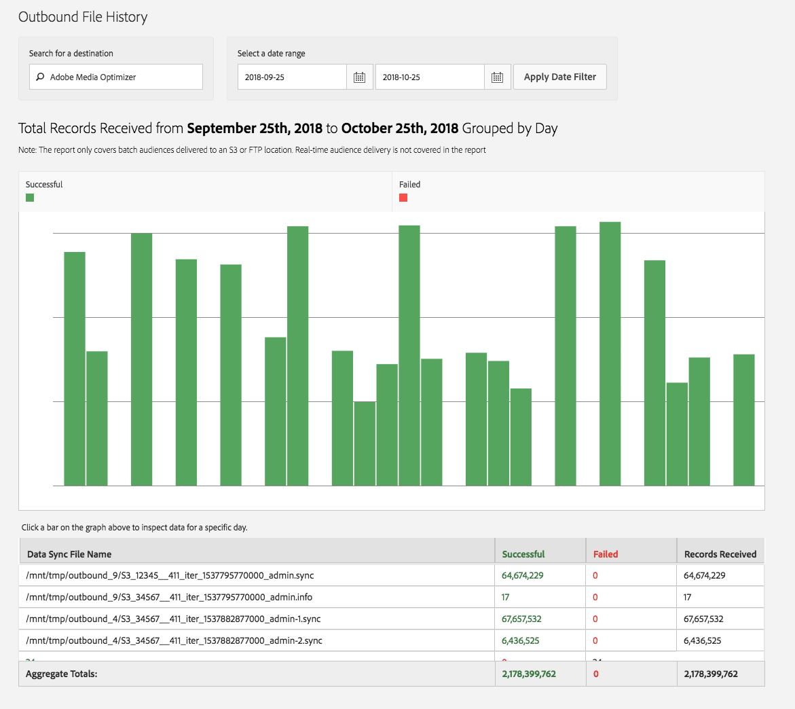

# Historial de archivos de salida {#outbound-file-history}

Ver información del historial de trabajos por lotes salientes para un destino y período de tiempo especificados.

<!-- 

t_reports_outbound_history.xml

 -->

1. Haga clic en **[!UICONTROL Analytics]** > **[!UICONTROL Outbound File History]**.

   

1. En el cuadro **[!UICONTROL Search for a Destination]**, empiece a escribir y seleccione el destino deseado.
1. En el cuadro **[!UICONTROL Select a Date Range]**, especifique las fechas de inicio y finalización del informe y haga clic en **[!UICONTROL Apply Date Filter]**.

   

   La siguiente tabla contiene información correspondiente a las columnas del informe:

<table id="table_93076D46AC50411395E72B9B987E99BE"> 
 <thead> 
  <tr> 
   <th colname="col1" class="entry"> Líneas </th> 
   <th colname="col2" class="entry"> Descripción </th> 
  </tr> 
 </thead>
 <tbody> 
  <tr> 
   <td colname="col1"> Nombre del archivo de sincronización de datos </td> 
   <td colname="col2"> 
Lista de todos los archivos salientes que  Adobe generó para este destino y que se procesaron juntos. 
 </td> 
  </tr> 
  <tr> 
   <td colname="col1"> Correcto </td> 
   <td colname="col2"> 
Número de registros enviados correctamente desde  Audience Manager al destino. 
 </td> 
  </tr> 
  <tr> 
   <td colname="col1"> Error </td> 
   <td colname="col2"> 
Número de registros que no se pudieron enviar al destino. 
 </td> 
  </tr> 
  <tr> 
   <td colname="col1"> Registros recibidos </td> 
   <td colname="col2"> 
Número total de registros  Adobe generados en los archivos y que se intentó enviar al destino. En la mayoría de los casos, debe ser el número total de archivos correctos y fallidos. 
 </td> 
  </tr> 
 </tbody> 
</table>
