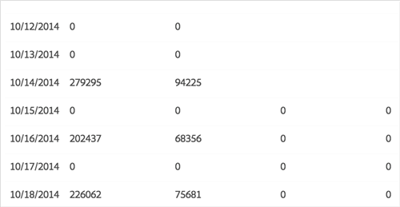

# Informes de tendencias{#trend-reports}

Un informe de tendencias devuelve datos de tendencias en características y segmentos.

## Información general {#trend-report-overview}

<!-- 

c_trend_reports.xml

 -->

[!DNL Audience Manager] utiliza [!UICONTROL Role Based Access Control] ([!UICONTROL RBAC]) para ampliar los permisos de grupo de usuarios a los [!UICONTROL Trend] informes. Los usuarios solo pueden ver esas características y segmentos en los informes que tienen permisos para ver. [!UICONTROL RBAC] permite controlar los datos que pueden ver los equipos internos de informes.

Por ejemplo, una agencia que gestiona diferentes cuentas de anunciante puede configurar permisos de grupo de usuarios para que un equipo que administra la cuenta del anunciante A no pueda ver los datos de informes del anunciante B.

Ejecute un [!UICONTROL Trend] informe cuando necesite:

* Revise los datos de tendencia por características y segmentos.
* Rastree las tendencias en intervalos de 1, 7, 14, 30, 60 y 90 días.
* Compare las tendencias de rasgos y segmentos con el paso del tiempo.
* Identifique los segmentos y características de rendimiento sólidos o deficientes.
* Exporte datos (formato .csv) para realizar más análisis y compartir.

En la siguiente ilustración se proporciona una visión general de alto nivel de los elementos clave del [!UICONTROL Trend] informe.

1. Configure las siguientes opciones:

   **** Tipo de informe: Seleccione el tipo de informe deseado (característica o segmento).

   **** Intervalo de fechas: Especifique el intervalo de fechas del informe (fecha de inicio y fecha de finalización).

   **** Intervalo de visualización: Especifique el intervalo de visualización (intervalos de 1, 7, 14, 30, 60 y 90 días).

2. Busque un rasgo o segmento por nombre o ID.
3. En la lista de carpetas, arrastre y suelte las características o los segmentos que desee incluir en el informe en el panel de la derecha [!UICONTROL Selections] .
4. Genere el informe para mostrarlo en formato gráfico o exporte el informe a formato CSV.

## Run a Trend Report {#run-trend-report}

Este procedimiento describe cómo ejecutar un [!UICONTROL Trend] informe.

<!-- 

t_working_with_trend_reports.xml

 -->

1. En el **[!UICONTROL Analytics]** tablero, haga clic en **[!UICONTROL Trend Reports]**.
1. En la lista **[!UICONTROL Report Type]** desplegable, seleccione el tipo que desee: **[!UICONTROL Trait]** o **[!UICONTROL Segment]**.
1. Haga clic en los cuadros de fecha para mostrar un calendario y seleccione las fechas de inicio y finalización del informe.
1. Especifique el intervalo de visualización: por 1, 7, 14, 30, 60 o 90 días.
1. Busque un rasgo o segmento por nombre o ID.
1. En la lista de carpetas, arrastre y suelte las características o los segmentos que desee incluir en el informe en el panel de la derecha [!UICONTROL Selections] .

   Para obtener el mejor rendimiento, ejecute un [!UICONTROL Trend] informe con menos de 20 características o segmentos a la vez.
1. Haga clic en **[!UICONTROL Graph Traits]** o **[!UICONTROL Graph Segments]**, según el tipo de informe que esté viendo (características o segmentos).

   Estas opciones ignoran todas las carpetas y gráficos solo en los segmentos o características seleccionados individualmente.

   O

   Haga clic en **[!UICONTROL Export to CSV]** para exportar los datos de características o segmentos y todas las carpetas en formato CSV para analizarlos y compartirlos. Esto exporta el [!UICONTROL Unique Trait Realizations], [!UICONTROL Total Trait Realizations]y [!UICONTROL Total Trait Population] para todos los intervalos de días.

   >[!NOTE]
   >
   >[!UICONTROL Total Trait Realizations] se calculan [!UICONTROL Rule-based Traits] únicamente para.

1. (Opcional) Pase el cursor sobre características o segmentos individuales para mostrar el número de visitas y la fecha de cada punto de datos.

   Puede hacer clic en los encabezados de columna de la tabla para ordenar los resultados en orden ascendente o descendente.

Para [!UICONTROL Trended Trait] los informes, los ceros indican que [!DNL Audience Manager] no se recopilaron datos para ese día. Las entradas en blanco indican que la característica no existe. El siguiente ejemplo muestra ejemplos de ambos tipos de entradas:

