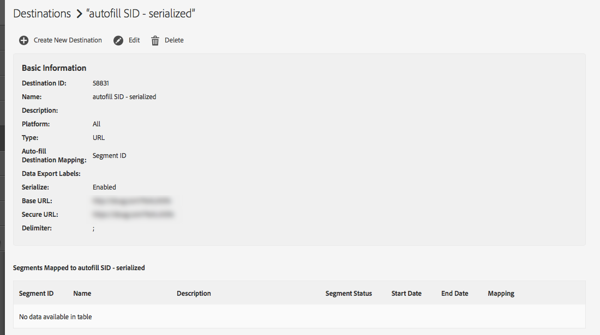

# ¿Debería ver los segmentos asignados por Audience Lab en la página de detalles de destino? {#audience-lab-segments-destination-page}

## Pregunta

Tengo algunos segmentos de prueba creados en [!UICONTROL Audience Lab] y los he asignado a un destino. Sin embargo, cuando los busco en la página de detalles de destino, no los veo.

¿Este comportamiento es normal o se trata de un error?

## Respuesta

Los segmentos asignados que se crean dentro de [!UICONTROL Audience Lab] no se muestran en la página de detalles de destino.

Por ejemplo, en las capturas de pantalla siguientes, [!UICONTROL Test Segment 1] y [!UICONTROL Test Segment 2] se asignan al destino de [!UICONTROL autofill SID - serialized].

Los segmentos sí se muestran en la prueba de segmentos de Audience Lab:

Sin embargo, los segmentos no aparecerán en la página de detalles de destino:

