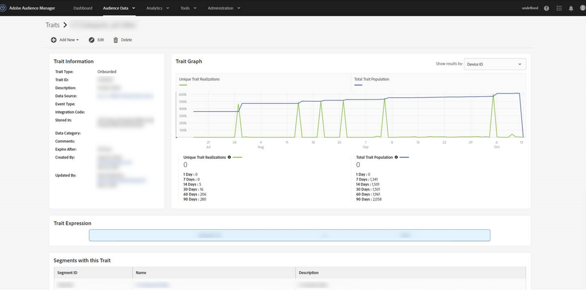

# ¿Por qué las poblaciones de rasgos integradas cayeron a 0 en torno al 15 de octubre? {#why-did-my-onboarded-trait-populations-drop-to-0-around-october}

## Pregunta

En torno al 14 de octubre de 2019, advertí que las poblaciones de rasgos integradas del gráfico de ID del dispositivo habían caído a 0, cuando anteriormente eran mucho más altas. ¿Por qué ocurrió esto?

## Respuesta

El 15 de octubre se cambió una actualización de la funcionalidad de la regla de combinación de perfiles de Audience Manager de tal forma que los datos incorporados desde un ID de CRM y cargados a una fuente de datos de varios dispositivos ya no se comparan con los ID de los dispositivos.  Anteriormente, Audience Manager se ejecutaba tanto con el ID en varios dispositivos (o el ID de CRM), como copiando esas realizaciones en los UUID asociados de Audience Manager (ID del dispositivo).  Se llevó a cabo este cambio para reflejar con mayor precisión la naturaleza de los datos de rasgos y los perfiles que se están obteniendo.

Para ver la percepción de los rasgos, busque la esquina superior derecha de la vista de rasgos y en la pestaña desplegable seleccione la opción “ID en varios dispositivos”.

